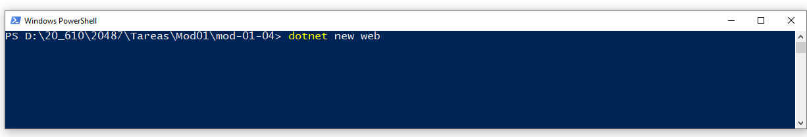
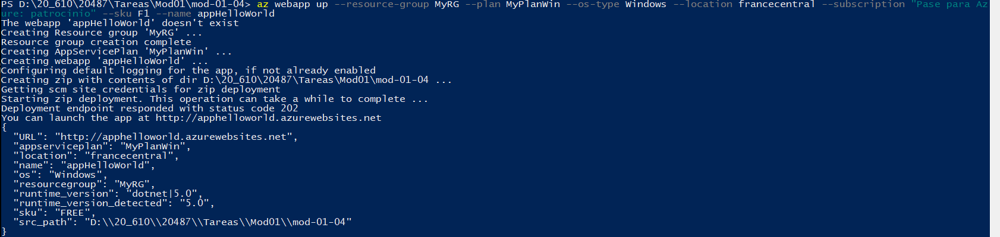
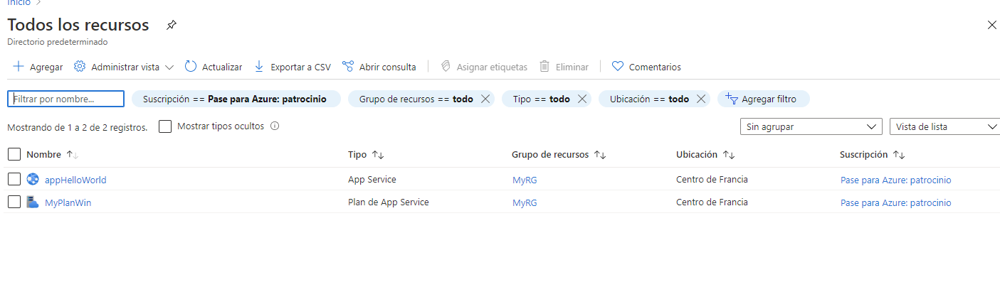
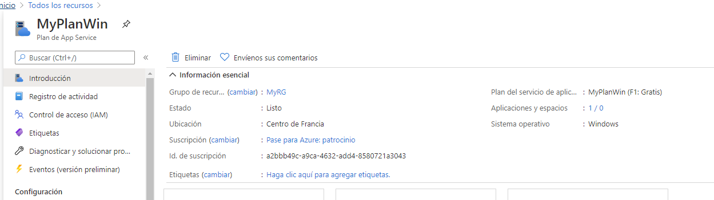
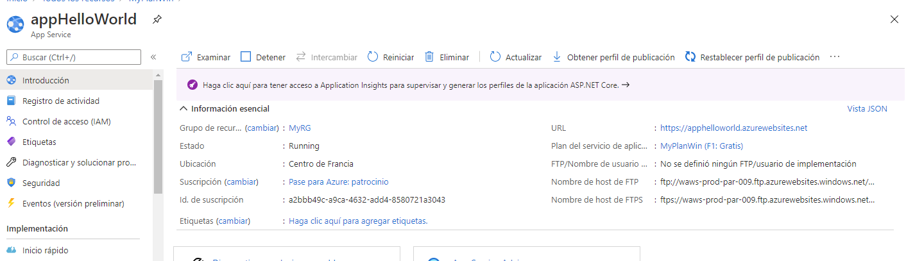
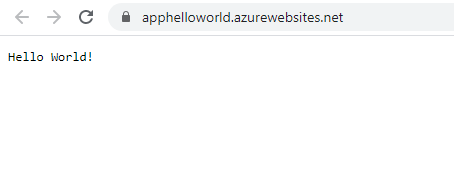
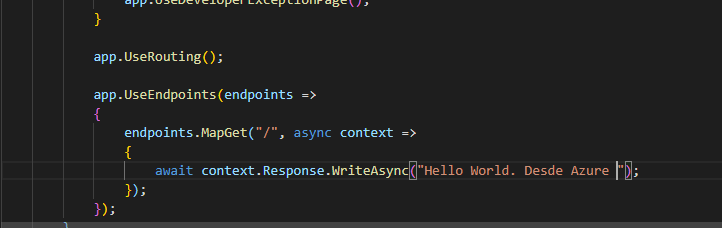
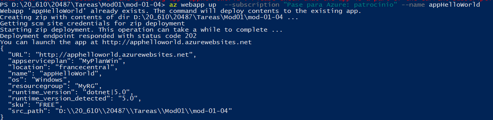
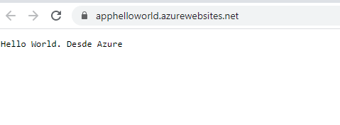

## Module1_L4 

### Exploring the Microsoft Azure Portal


subir una aplicacion a un appService


Creamos la aplicacion web 



Ejecutamos


Probamos en local !


Lo subimos a Azure
Nos logamos con az login


y la subimos he utilizado las siguientes opciones  

```
az webapp update --resource-group MyRG --plan MyPlanWin --os-type Windows --location francecentral --subscription "Pase para Azure: patrocinio" --sku F1 --name appHelloWorld 
```



Se ha creado el grupo de recursos 



Se ha creado el app plan service 



y la app web



Abrimos web



Bien ahora la vamos a modificar y atualizar



el comando utilizado es 

```
az webapp up  --subscription "Pase para Azure: patrocinio" --name appHelloWorld
```



ejecutamos y ok




