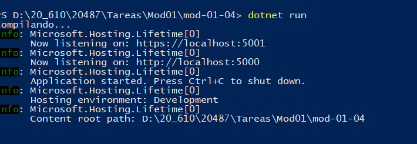
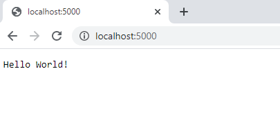
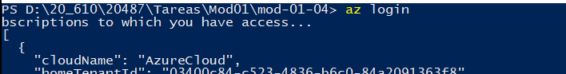

## Module 1: Overview of Service and Cloud Technologies

### Lesson 4: Cloud Computing

#### Demonstration: Exploring the Microsoft Azure Portal


Practica 01

subir una aplicacion a un appService


Creamos la aplicacion web 


ejecutamos



Ok en local !




Bien pues la vamos a subir con az  
Para ello nos logamos con az login



y la subimos he utilizado las siguientes opciones  

```
az webapp update --resource-group MyRG --plan MyPlanWin --os-type Windows --location francecentral --subscription "Pase para Azure: patrocinio" --sku F1 --name appHelloWorld 
```


Vemos que me ha creado el grupo de recursos (porque no existía)


ha creado el app plan service (porque no existía)


y la app web


La abrimos


Bien ahora la vamos a modificar y atualizar


el comando utilizado es (le tengo que indicar en mi caso la subscription porque no es la de por defecto

Unable to retrieve details of the existing app 'appHelloWorld'. Please check that the app is a part of the current subscription

```
az webapp up  --subscription "Pase para Azure: patrocinio" --name appHelloWorld
```


ejecutamos y ok


